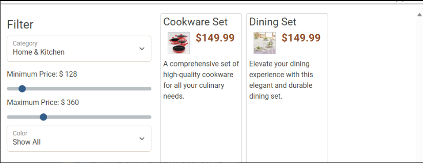
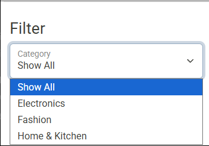
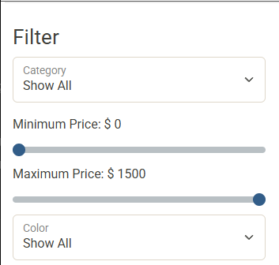
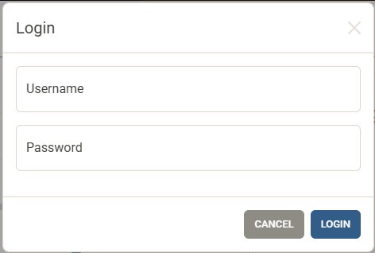

# IdeaTradeShop – E-Commerce API
 
This is a backend-focused e-commerce application built with Java and Spring Boot.

The main focus of this project is building a secure REST API with authentication,
authorization, and product/category management.

---

##  Technologies Used

- Java
- Spring Boot
- Spring Security (JWT)
- MySQL
- JDBC
- Insomnia (API Testing)

---

##  Authentication & Security

- Users can register and log in
- Login returns a JWT token
- JWT token is required for protected endpoints
- Role-based access:
    - `ROLE_USER`
    - `ROLE_ADMIN`

---

##  Front-End Overview

The provided front-end website was used to demonstrate the API functionality.

### Example Filter
Displays filtered products.

---

### Category Filtering
Users can filter products by category.  
This feature uses the `/products/search` endpoint.

---

### Price Range Filtering
Users can filter products using minimum and maximum price sliders.

---

### Login Modal
Users can log in using the login modal.  
A successful login stores the JWT token for future requests.

---

##  API Testing (Insomnia)

All API endpoints were tested using Insomnia with the provided collection file.

Tested scenarios include:
- User registration and login
- JWT authentication
- Admin vs non-admin access
- Category CRUD operations
- Product search and management

---

##  Implemented Features

### Authentication
- User registration (`POST /register`)
- User login (`POST /login`)
- JWT token generation
- Secured endpoints

**Key files:**
- `AuthenticationController`
- `TokenProvider`
- `JWTFilter`
- `WebSecurityConfig`

---

### Categories & Products

#### Categories
- Get all categories
- Get category by ID
- Add category (Admin only)
- Delete category (Admin only)

**Key files:**
- `CategoriesController`
- `CategoryDao`
- `MySqlCategoryDao`

#### Products
- Search products with filters
- Get product by ID
- Add product (Admin only)
- Update product (Admin only)
- Delete product (Admin only)

**Key files:**
- `ProductsController`
- `ProductDao`
- `MySqlProductDao`

---

##  Notes

This project focuses on:
- Clean controller logic
- Proper HTTP status codes
- Secure authentication
- Clear separation of concerns (Controller / DAO / Model)

---

##  Author

Omer Faruk Akcam  
Year Up – Application Development
